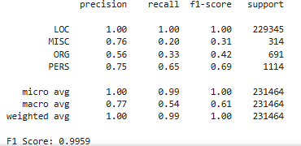
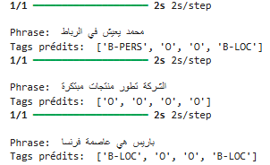

# Named Entity Recognition (NER) in Arabic Using an LSTM Model

This project focuses on developing a Named Entity Recognition (NER) system for the Arabic language using a Long Short-Term Memory (LSTM) neural network with pre-trained word embeddings. The model is trained on the ANERCorp dataset and leverages Word2Vec embeddings to capture semantic relationships between words.

---

## Objectives

- Identify and classify named entities in Arabic texts (e.g., person names, locations, organizations, etc.).
- Use an LSTM model to capture contextual dependencies within word sequences.
- Evaluate the model's performance using metrics such as precision, recall, and F1-score.

---

## Technologies Used

- **Python**: Main programming language.
- **TensorFlow/Keras**: For building and training the LSTM model.
- **Gensim**: To load Word2Vec embeddings.
- **NumPy/Pandas**: For data manipulation.
- **Matplotlib**: For visualizing results.
- **Seqeval**: For evaluating NER model performance.

---

## Project Structure

- **`NER_Lstm_Soft.ipynb`**: Jupyter notebook containing the full code for training and evaluating the model.
- **`weights.weights.h5`**: File containing the trained model weights.
- **`README.md`**: Descriptive file of the project (this file).

---

## Data

The model is trained on the ANERCorp dataset, which contains Arabic texts annotated with named entities. Word embeddings are derived from a Word2Vec model trained on an Arabic corpus.

---

## How to Run the Code

1. **Download the Data**:
   Ensure you have the required files, including the ANERCorp dataset and Word2Vec embeddings.

2. **Install Dependencies**:
   Run the following command to install the necessary libraries:

   ```bash
   pip install tensorflow gensim numpy pandas matplotlib seqeval
   ```

3. **Execute the Notebook**:
   Open the `NER_Lstm_Soft.ipynb` notebook in a Jupyter environment and run the cells to train and evaluate the model.

---

## Results

The model achieves an F1-score of **99.59%** on the test set, demonstrating excellent ability to identify named entities in Arabic texts.





### Example Predictions

1. **Sentence**: "محمد يعيش في الرباط"  
   **Predicted Tags**: `['B-PERS', 'O', 'O', 'B-LOC']`

2. **Sentence**: "الشركة تطور منتجات مبتكرة"  
   **Predicted Tags**: `['O', 'O', 'O', 'O']`

3. **Sentence**: "باريس هي عاصمة فرنسا"  
   **Predicted Tags**: `['B-LOC', 'O', 'O', 'B-LOC']`




---

## Possible Improvements

- Integrate contextual embeddings such as BERT for better contextual understanding.
- Use data augmentation techniques to expand the training dataset.
- Explore more advanced architectures like Transformers.

--- 

## License

- This project is licensed under the MIT license. See the LICENSE file for more details.

----

## Contact 

- [Linkedin](https://www.linkedin.com/in/el-hassan-bensalih-01822924b/)
